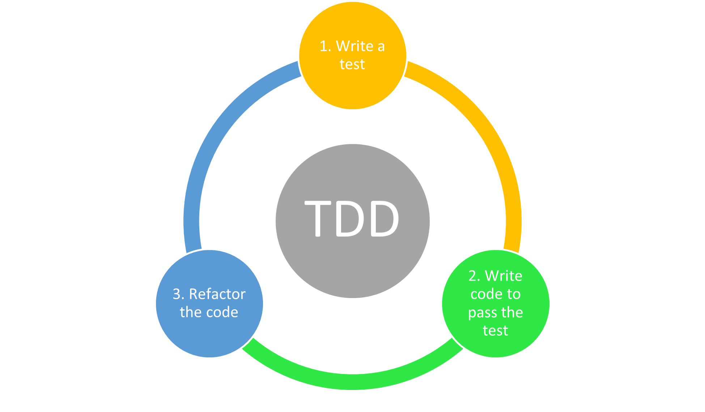

# Test Driven Development
 
Test Driven Development, shortened as TDD, is a set of techniques that “encourages simple designs and test suites that inspire confidence”. To use TDD, your work should be divided in the simplest steps possible, each step is focused on only one task. Every step should follow this algorithm:
 
1. Write a test for the new function or piece of code that you want to implement. The test should fail.
2. Write only enough code to pass this test.
3. Refactor the code.
4. Goto 1



## Project Setup

### Install Python

Before starting, make sure you have installed [Python](https://www.python.org/downloads/). In this tutorial, Python 3.8 is used.

### Setting up virtual environment

It is a good practice to isolate the project that we are working on from the rest of the system. You can use [venv](https://realpython.com/python-virtual-environments-a-primer/) or [pyenv](https://amaral.northwestern.edu/resources/guides/pyenv-tutorial)

### Install Pytest

For testing we're going to use [pytest](pytest.org) as a testing framework. so you can install this tool with:
```
pip install -r requirements.txt
```

## Recommendations

### Naming the test

There is no rule when naming test but your test will be more Self-documenting if you have this parts:

 - Name of the method or function you are testing
 - What the method or function is supposed to do
 - Under what circumstances

Example:


```py
def test__sum_two_numbers_function__returns_twelve__when_inputs_are_five_and_seven():
          ------------------------  --------------  ------------------------------
                    |                     |                       |
                    |                     |                       |
                    |                     |                       |
           Name of the function.     What it does.    Conditions of the arguments.

```
**Note:** Double underscore is used between each part.
 

### Parts of a test:

To make a test more readable, you can divide your test in:
 - Setup (creating mocks, stubs or the values of the arguments)
 - Execution (calling the method or function)
 - Assertion (assert that mocks were called and right values are returned) 

Example:

```py
def test__sum_two_numbers_function__returns_twelve__when_inputs_are_five_and_seven():
    #Setup
    number_1 = 5
    number_2 = 7

    #Execution
    result = sum_two_numbers(number_1, number_2)

    #Assertions
    assert result == 12
```
**Note:** There is one space between the parts of the test.


### Happy Path and Sad Path

Is recommended to consider first what users are supposed to do when using our application and write test for this scenarios, this is called **"happy path"**.
After that, testing the **"sad paths"**, or the many ways that users can break our app is important, since it will help handling errors.

## TDD Example 1

In the first example we are going to create a calculator using TDD. To do the example by yourself, goto [Example](./example_1/README.md).

If you want to check the answer for this dojo, do:
```
git checkout Exercise_1_Solution
```

## TDD Example 2

In the second example we are going to build the [Game of life](https://en.wikipedia.org/wiki/Conway%27s_Game_of_Life) using TDD.  To do the example by yourself, goto [Example](./example_2/README.md).

If you want to check the answer for this dojo, do:
```
git checkout Exercise_2_Solution
```
