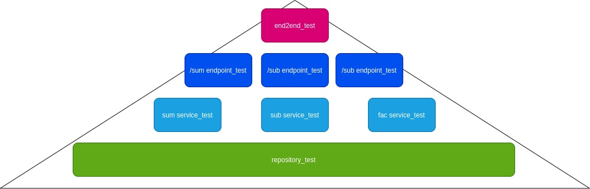

# Exercise 4

## Requirements:

Make sure that you are in the current directory.

Install [docker](https://docs.docker.com/engine/install/)

Install [docker-compose](https://docs.docker.com/compose/install/)

You can install the requirements or simply develop on docker.
```sh
pip install -r requirements.txt

```
### Start the containers

To run all services:
```sh
make up
```
### Test

To run all tests:
```sh
make test-all
```

### End2end test:

Start the containers:

```sh
make up
```

Run the test:

```sh
make test-end2end
```
### Stop the containers:

```sh
make stop
```
## Exercise 4

In this excercise we are going to build an api to show some concepts of the test pyramid, the api will have similar functions to the applications we build in excercise 1 and 3. It has three endpoints:

- (/sum/x/x) to return the addition of two numbers.
- (/sub/x/x) to return the subtraction of two numbers.
- (/fac/x) to return the factorial of two numbers.

In addition, all the operations made by the applications are stored in a database, al the api can return the operation and the result using the endpoint ```/<id:int>```, the id is the identifier of the application.
To develop this example, we are going to use flask as the backend with sqlalchemy and postgres. This repository is preloaded with the frontend of the application in the [/client](./client) directory so to run the test you can use this frontend, to start the frontend you should cd into client (```cd client```), ```npm start``` to install the dependencies and ```ng serve``` to start the frontend.

The tests that we are going to perform to complete the exercise are this:



The process that we are going to follow is, write the highest-level test and mock every thing under it, once everything pass, we can go to the next level, write the test, write the code to pass the test and re-write the tests of the hiehest levels to use the code we have implemented.

### end2end tests

First, we are going to start with the end2end test. To do this, we are using selenium, this test is going to make request to every endpoint and mock the response, this is done in [end2end_test.py](api/test/end2end/end2end_test.py).

### endpoint tests

Then we have to make the test for every endpoint, this is done in the [endpoint](api/test/endpoints) folder.

### service tests

This test are very similar of what we did in example 1 and 3. You can check the solution in [service](api/test/services) folder.

### repository tests

In this test we ensure that the data is saved using the repository, the test are in [repository](api/test/repository) folder.
